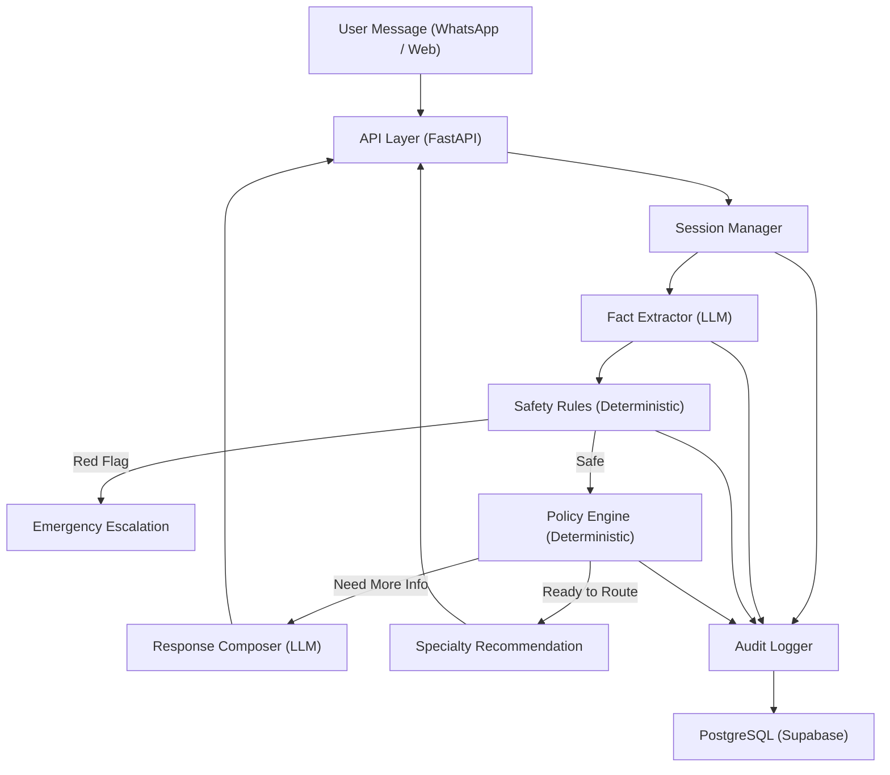
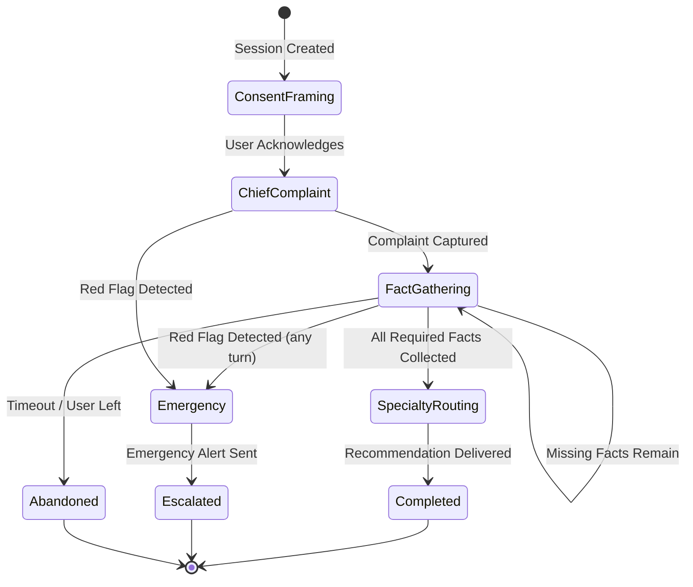

# Project Requirement Document (PRD)
# PEMA — AI-Powered Healthcare Triage Chatbot

**Version:** 1.0 (MVP)
**Date:** March 12, 2026
**Target Market:** Pakistan
**Primary Channel:** WhatsApp · Secondary: Mobile App
**Languages:** English, Roman Urdu (e.g., "mujhe bukhar hai")

---

## 1. Product Overview

### 1.1 What Is PEMA

PEMA is an AI-powered conversational triage chatbot that helps patients in Pakistan identify the correct medical specialty for their symptoms. It operates as a **routing tool**, not a diagnostic or prescriptive system.

### 1.2 Problem Statement

Patients in Pakistan frequently lack clarity on which type of doctor to visit for their symptoms. This leads to:

- Unnecessary visits to general practitioners when a specialist is needed.
- Delays in reaching the correct specialist, worsening health outcomes.
- Overcrowded emergency departments with non-emergency cases.
- Patients in rural or underserved areas having no easy way to get initial guidance.

### 1.3 Solution

A conversational AI that:

1. Accepts free-text symptom descriptions in **English** and **Roman Urdu**.
2. Asks focused follow-up questions to narrow down the problem.
3. Detects **red-flag emergency symptoms** and immediately triggers safety alerts.
4. Recommends the appropriate **doctor specialty** (e.g., cardiologist, dermatologist).
5. Provides a brief, plain-language rationale for the recommendation.

### 1.4 Explicit Scope Boundaries

| In Scope | Out of Scope |
|---|---|
| Symptom-to-specialty routing | Medical diagnosis |
| Emergency red-flag detection & alerts | Prescriptions or treatment plans |
| Roman Urdu + English understanding | Referral to specific named doctors |
| WhatsApp-first delivery | Insurance/billing integration |
| Session-based conversational flow | Patient medical records/EHR integration |
| Audit trail of every decision | Appointment booking |

---

## 2. Target Users

### 2.1 Primary Persona — The Patient

- **Demographics:** Adults (18–65) in Pakistan; may be seeking care for themselves, their children, or elderly family members.
- **Language:** Communicates in English or Roman Urdu; may code-switch mid-conversation.
- **Tech context:** Uses WhatsApp daily; comfortable with text chat but not with medical terminology.
- **Need:** "I have these symptoms — what kind of doctor should I see?"

### 2.2 Secondary Persona — Internal Admin / Medical Reviewer

- **Role:** PEMA team member responsible for quality assurance.
- **Need:** Inspect completed triage sessions, review decision paths, identify failure cases, and tune safety rules.

---

## 3. Core Functional Requirements

### 3.1 Symptom Intake (FR-01)

| ID | Requirement |
|---|---|
| FR-01.1 | The system **MUST** accept free-text messages from the user describing symptoms in English or Roman Urdu. |
| FR-01.2 | The system **MUST** extract structured facts from free text, including: chief complaint, body region, symptom duration, severity, associated symptoms. |
| FR-01.3 | The system **MUST** identify when critical demographic facts are missing (age, sex, pregnancy status where relevant) and ask for them. |
| FR-01.4 | The system **MUST** handle mixed-language input (e.g., "meri chest mein pain hai from 2 days"). |

### 3.2 Follow-Up Questioning (FR-02)

| ID | Requirement |
|---|---|
| FR-02.1 | The system **MUST** ask **one focused follow-up question at a time** — no multi-question blocks. |
| FR-02.2 | The system **MUST** determine the next question based on what mandatory facts are still missing, using **code-driven logic** (not open-ended LLM conversation). |
| FR-02.3 | The system **SHOULD** limit total follow-up questions to a maximum of **8 turns** before producing a recommendation or escalating. |
| FR-02.4 | Follow-up questions **MUST** be phrased in plain, non-medical language. |

### 3.3 Red-Flag / Emergency Detection (FR-03)

| ID | Requirement |
|---|---|
| FR-03.1 | The system **MUST** run red-flag checks on **every user turn**, not only at session start. |
| FR-03.2 | Red-flag detection **MUST** be implemented in **deterministic backend code**, outside the LLM, to guarantee it cannot be bypassed or hallucinated away. |
| FR-03.3 | When a red flag is detected, the system **MUST** immediately: (a) halt the triage conversation, (b) display an emergency alert with instructions to call emergency services (1122 / local emergency number), (c) log the event. |
| FR-03.4 | Red-flag patterns for the MVP **MUST** include at minimum: chest pain with shortness of breath, severe bleeding, loss of consciousness, suicidal ideation, stroke signs (sudden numbness, confusion, vision loss), severe allergic reaction / anaphylaxis signs, severe abdominal pain with fever. |
| FR-03.5 | The system **MUST NOT** allow the conversation to continue in normal triage mode after an emergency escalation. |

### 3.4 Specialty Recommendation (FR-04)

| ID | Requirement |
|---|---|
| FR-04.1 | The system **MUST** map the collected facts to exactly **one specialty** from the fixed specialty enum. |
| FR-04.2 | The MVP specialty enum **MUST** include: General Practitioner, Pediatrician, Gynecologist, Dermatologist, ENT, Pulmonologist, Gastroenterologist, Orthopedist, Neurologist, Urologist, Psychiatrist, Emergency Department. |
| FR-04.3 | The recommendation **MUST** include: urgency level (emergency / urgent / routine), recommended specialty, and a brief plain-language rationale. |
| FR-04.4 | Confidence thresholds and specialty-mapping rules **MUST** be implemented in **backend code**, not delegated to the LLM. |

### 3.5 Session Management (FR-05)

| ID | Requirement |
|---|---|
| FR-05.1 | Each triage interaction **MUST** be treated as a discrete session with a unique ID. |
| FR-05.2 | Session state **MUST** persist across turns (extracted facts, turn count, triggered rules, current conversation phase). |
| FR-05.3 | Sessions **MUST** have defined terminal states: completed (recommendation given), escalated (emergency), abandoned (user left or timed out), closed (explicitly ended). |
| FR-05.4 | The system **MUST** support explicit session closure via API. |

### 3.6 Consent & Framing (FR-06)

| ID | Requirement |
|---|---|
| FR-06.1 | At session start, the system **MUST** present a framing message explaining that it helps route users to the right doctor type and **does not diagnose, prescribe, or replace professional medical advice**. |
| FR-06.2 | The framing message **MUST** be available in both English and Roman Urdu. |

### 3.7 Audit & Traceability (FR-07)

| ID | Requirement |
|---|---|
| FR-07.1 | Every turn **MUST** be logged with: raw user input, extracted facts, triggered safety rules, LLM prompt version, LLM raw output, final system response, and decision rationale. |
| FR-07.2 | Audit data **MUST** be sufficient to fully reconstruct the decision path for any session. |
| FR-07.3 | Admin endpoints **MUST** expose session history and audit data for internal review. |

---

## 4. Non-Functional Requirements

### 4.1 Performance

| ID | Requirement |
|---|---|
| NFR-01 | End-to-end response latency (user message → system reply) **SHOULD** be under **4 seconds** for 95% of requests. |
| NFR-02 | The system **MUST** handle concurrent sessions without data leakage between sessions. |

### 4.2 Safety & Compliance

| ID | Requirement |
|---|---|
| NFR-03 | Red-flag detection **MUST** have a false-negative rate of **0%** for defined emergency patterns — it is acceptable to over-trigger, but never to miss a true emergency. |
| NFR-04 | The system **MUST NOT** produce output that could be interpreted as a medical diagnosis or treatment recommendation. |
| NFR-05 | All system responses **MUST** include language that reinforces the routing-only nature of the tool. |

### 4.3 Language & Localization

| ID | Requirement |
|---|---|
| NFR-06 | The LLM **MUST** correctly interpret Roman Urdu symptom descriptions (e.g., "bukhar" = fever, "sar dard" = headache, "pet mein dard" = stomach pain). |
| NFR-07 | System-generated responses **SHOULD** match the language the user is writing in (English reply for English input, Roman Urdu reply for Roman Urdu input). |

### 4.4 Architecture & Extensibility

| ID | Requirement |
|---|---|
| NFR-08 | The conversation engine **MUST** be channel-independent — core triage logic must not depend on WhatsApp, web, or any specific transport layer. |
| NFR-09 | The API **MUST** follow RESTful conventions with typed request/response schemas. |
| NFR-10 | All business rules (specialty mapping, urgency scoring, red-flag patterns) **MUST** be configurable without redeploying the LLM prompts. |

---

## 5. System Architecture (MVP)

### 5.1 Technology Stack

| Layer | Technology | Rationale |
|---|---|---|
| Language | Python 3.12 | Mature AI/API ecosystem |
| API Framework | FastAPI | Typed schemas, auto-docs, strong DX |
| Validation | Pydantic v2 | Strict models for session state, LLM outputs, rule decisions |
| LLM | OpenAI Responses API | Structured output, deterministic JSON, controlled orchestration |
| Database | PostgreSQL (Supabase) | Managed Postgres for sessions, messages, facts, audit |
| Auth | Deferred to Phase 2 | Not needed for internal testing |
| Test Frontend | Web Sandbox (browser) | Faster and safer than starting with WhatsApp for initial testing |

### 5.2 Engine Module Breakdown



| Module | Responsibility | LLM or Code |
|---|---|---|
| Session Manager | Create, update, and close triage sessions | Code |
| Fact Extractor | Parse free text into structured JSON facts | **LLM** |
| Safety Rules | Detect emergency red-flag patterns | Code |
| Policy Engine | Decide next action (ask more, escalate, complete) | Code |
| Response Composer | Generate the user-facing message (question or recommendation) | **LLM** |
| Audit Logger | Persist full trace data for every turn | Code |

> [!IMPORTANT]
> Only the Fact Extractor and Response Composer use the LLM. All control flow, safety checks, and routing decisions are deterministic code. This is a core safety design principle.

### 5.3 Conversation State Machine



**States:**

1. **Consent & Framing** — Disclaimer shown; waiting for user acknowledgment.
2. **Chief Complaint** — Capture primary symptom in user's own words.
3. **Fact Gathering** — Iteratively collect mandatory facts (age, sex, duration, severity, associated symptoms). Red-flag check runs on every turn.
4. **Emergency** — Red flag detected; conversation halted; emergency instructions shown.
5. **Specialty Routing** — Sufficient facts collected; compute urgency + specialty.
6. **Completed** — Recommendation delivered; session closed.
7. **Abandoned** — User timeout or explicit exit.

---

## 6. Data Model

### 6.1 Database Tables

| Table | Key Fields | Purpose |
|---|---|---|
| `triage_sessions` | `id`, `status`, `channel`, `language`, `created_at`, `updated_at`, `engine_version` | Master session record |
| `messages` | `session_id`, `role` (user/system), `message_text`, `timestamp`, `turn_number` | Full conversation history |
| `session_facts` | `session_id`, `age`, `sex`, `chief_complaint`, `duration`, `severity`, `urgency`, `specialty`, `confidence` | Structured extracted facts |
| `rule_events` | `session_id`, `rule_name`, `severity`, `evidence_snippet`, `timestamp` | Triggered safety rules |
| `model_audits` | `session_id`, `prompt_version`, `model_name`, `structured_output_json`, `latency_ms`, `trace_id` | LLM call traces |

### 6.2 Specialty Enum

```python
class Specialty(str, Enum):
    GENERAL_PRACTITIONER = "general_practitioner"
    PEDIATRICIAN = "pediatrician"
    GYNECOLOGIST = "gynecologist"
    DERMATOLOGIST = "dermatologist"
    ENT = "ent"
    PULMONOLOGIST = "pulmonologist"
    GASTROENTEROLOGIST = "gastroenterologist"
    ORTHOPEDIST = "orthopedist"
    NEUROLOGIST = "neurologist"
    UROLOGIST = "urologist"
    PSYCHIATRIST = "psychiatrist"
    EMERGENCY_DEPARTMENT = "emergency_department"
```

### 6.3 Urgency Enum

```python
class Urgency(str, Enum):
    EMERGENCY = "emergency"      # Call 1122 / go to ER immediately
    URGENT = "urgent"            # See a doctor within 24 hours
    ROUTINE = "routine"          # Schedule an appointment at your convenience
```

---

## 7. API Specification (MVP)

| Method | Endpoint | Request Body | Response | Purpose |
|---|---|---|---|---|
| `POST` | `/sessions` | `{ language?: "en" \| "ur" }` | Session ID, status, framing message | Create new triage session |
| `POST` | `/sessions/{id}/messages` | `{ text: string }` | System response, session status, extracted facts (if changed), triggered rules (if any) | Send user message, receive engine response |
| `GET` | `/sessions/{id}` | — | Session state, extracted facts, conversation phase | View current session state |
| `POST` | `/sessions/{id}/close` | `{ reason?: string }` | Confirmation | Explicitly close/abandon session |
| `GET` | `/admin/sessions` | Query params: `status`, `date_range` | List of session summaries | Admin: list recent sessions |
| `GET` | `/admin/sessions/{id}` | — | Full message history, rule events, model audits | Admin: inspect individual session |

---

## 8. Safety Rules (MVP Red-Flag Definitions)

These rules are **hardcoded in backend logic** and checked on every user turn:

| Rule ID | Trigger Pattern | Action |
|---|---|---|
| `RF-001` | Chest pain + shortness of breath | Emergency escalation |
| `RF-002` | Severe or uncontrolled bleeding | Emergency escalation |
| `RF-003` | Loss of consciousness / fainting | Emergency escalation |
| `RF-004` | Suicidal ideation / self-harm mention | Emergency escalation + crisis helpline info |
| `RF-005` | Stroke signs (sudden numbness, slurred speech, vision loss, severe headache) | Emergency escalation |
| `RF-006` | Severe allergic reaction (throat swelling, difficulty breathing, facial swelling) | Emergency escalation |
| `RF-007` | Severe abdominal pain with fever and vomiting | Urgent escalation |
| `RF-008` | High fever (>104°F / 40°C) in children under 5 | Emergency escalation |
| `RF-009` | Seizure / convulsion | Emergency escalation |
| `RF-010` | Pregnancy-related bleeding or severe pain | Emergency escalation |

> [!CAUTION]
> Red-flag rules must **never** be delegated to the LLM. They must execute as deterministic code checks on both the raw user input and extracted facts. False negatives (missing a real emergency) are unacceptable.

---

## 9. Language Support (MVP)

### 9.1 Input Understanding

The LLM must correctly interpret common Roman Urdu health expressions:

| Roman Urdu | English Meaning |
|---|---|
| bukhar | fever |
| sar dard | headache |
| pet mein dard | stomach pain |
| seenay mein dard | chest pain |
| khansee | cough |
| ulti | vomiting |
| dasst | diarrhea |
| chakkar | dizziness |
| jor dard / gathiyon mein dard | joint pain |
| saans lene mein takleef | difficulty breathing |
| jild par daane / phunsiyan | skin rash / pimples |
| khoon | blood / bleeding |
| neend nahi aati | insomnia |
| ghabrahat | anxiety / restlessness |

### 9.2 Response Language

- If the user writes in **English**, respond in English.
- If the user writes in **Roman Urdu**, respond in Roman Urdu.
- If the user **code-switches**, prefer the dominant language of the message.

### 9.3 Red-Flag Keyword Matching

Safety rules must include **both English and Roman Urdu variants** of trigger keywords. For example:

- "chest pain" **and** "seenay mein dard"
- "bleeding" **and** "khoon beh raha hai"
- "saans nahi aa rahi" → difficulty breathing → escalate

---

## 10. Conversation Design

### 10.1 Sample Flow — Routine Case (English)

```
SYSTEM: Hi! I'm PEMA, your health guide. I can help you figure out what
        type of doctor to visit based on your symptoms.
        ⚠️ I don't diagnose or prescribe. If this is an emergency,
        please call 1122 immediately.
        Tell me, what's bothering you today?

USER:   I've been having a bad stomach ache for 3 days

SYSTEM: I'm sorry to hear that. Can you tell me your age?

USER:   32

SYSTEM: Is the pain constant or does it come and go?

USER:   It comes and goes, mostly after eating

SYSTEM: Have you noticed any other symptoms like nausea, vomiting,
        or changes in your bowel habits?

USER:   Yes, some nausea and bloating

SYSTEM: Based on what you've shared — recurring stomach pain after
        meals with nausea and bloating — I'd recommend seeing a
        **Gastroenterologist** (stomach and digestive system doctor).

        Urgency: Routine — you can schedule an appointment at your
        convenience, but don't delay if the pain worsens.

        Remember, this is guidance only. Please consult the doctor
        for a proper evaluation. Take care!
```

### 10.2 Sample Flow — Emergency Case (Roman Urdu)

```
SYSTEM: Assalam o Alaikum! Main PEMA hoon. Main aapko batata hoon
        ke aapko kis qisam ke doctor ke paas jana chahiye.
        ⚠️ Main diagnose ya dawai nahi deta. Agar emergency hai
        to abhi 1122 call karein.
        Batayein, kya takleef hai?

USER:   Meri seenay mein bohat dard hai aur saans lene mein
        mushkil ho rahi hai

SYSTEM: 🚨 EMERGENCY ALERT 🚨
        Seenay mein dard aur saans ki takleef bohat serious ho
        sakti hai.

        ❌ Is waqt mujhse baat mat karein.
        ✅ ABHI 1122 call karein ya qareeb ke hospital ke
           emergency mein jayein.

        Agar koi sath hai to unhe bhi batayein. Waqt zaya na karein.
```

### 10.3 Response Style Guidelines

- **Length:** 1–3 short sentences per message. Never more than 5 lines.
- **Tone:** Warm, clear, reassuring. Not clinical or robotic.
- **Medical terms:** Always explain in plain language. E.g., "Gastroenterologist (stomach and digestive system doctor)."
- **Disclaimers:** Every recommendation must end with a reminder that this is routing guidance, not a diagnosis.
- **Emergency:** Use bold, emojis (🚨), and clear action steps. Override all other response formatting.

---

## 11. Development Roadmap (MVP)

The MVP is built in **6 incremental steps**, each testable independently:

| Step | Name | Description | Key Deliverables |
|---|---|---|---|
| 1 | **Deterministic Skeleton** | Sessions, schema, emergency rules, specialty enums, basic policy engine — **no LLM** | Working API with hardcoded responses, safety rules functional |
| 2 | **Structured Extraction** | Add LLM call to convert free text → validated JSON facts | Fact Extractor module, Pydantic schemas for facts |
| 3 | **Next-Question Logic** | Code determines missing data; LLM phrases the follow-up question | Policy Engine + Response Composer integration |
| 4 | **Completion Logic** | Compute urgency + specialty when facts are sufficient; generate recommendation | End-to-end triage flow working |
| 5 | **Test Harness** | Scripted test cases covering key scenarios | Automated tests for emergency, pediatric, pregnancy, respiratory, neurological, urinary cases |
| 6 | **Internal Review UI** | Simple admin page to inspect sessions, failures, and rule triggers | Admin endpoints + basic web dashboard |

> [!NOTE]
> WhatsApp integration is **not part of the MVP**. The MVP is validated via the web sandbox and API testing tools (Swagger/Postman). WhatsApp integration is the immediate follow-up phase.

---

## 12. MVP Test Scenarios

These are the minimum scenarios the test harness (Step 5) must cover:

| ID | Scenario | Expected Outcome |
|---|---|---|
| TS-01 | Adult with stomach pain after meals, nausea | Routine → Gastroenterologist |
| TS-02 | Adult with chest pain + shortness of breath | Emergency escalation, conversation halted |
| TS-03 | Child (age 3) with high fever >104°F | Emergency escalation |
| TS-04 | Adult with persistent headaches, blurred vision | Urgent → Neurologist |
| TS-05 | Adult female with irregular periods, pelvic pain | Routine → Gynecologist |
| TS-06 | Pregnant woman with bleeding | Emergency escalation |
| TS-07 | Adult with skin rash for 2 weeks | Routine → Dermatologist |
| TS-08 | Adult with ear pain, hearing loss | Routine → ENT |
| TS-09 | Adult with cough, wheezing for 1 month | Urgent → Pulmonologist |
| TS-10 | Adult with joint pain, swelling in knees | Routine → Orthopedist |
| TS-11 | Adult with painful urination, blood in urine | Urgent → Urologist |
| TS-12 | User mentions suicidal thoughts | Emergency escalation + crisis helpline |
| TS-13 | Roman Urdu input: "mujhe bukhar hai aur sar dard" | Fact extraction works, follow-ups in Roman Urdu |
| TS-14 | Mixed-language: "meri back mein pain hai from 1 week" | Fact extraction works, correct specialty suggested |
| TS-15 | User provides minimal info and does not elaborate | System asks follow-ups, eventually defaults to General Practitioner |

---

## 13. MVP Acceptance Criteria

The MVP is considered complete when **all** of the following are true:

1. ✅ The engine handles a full session from symptom input → specialty recommendation in the web sandbox.
2. ✅ Emergency cases are **consistently** escalated — zero false negatives on defined red-flag patterns.
3. ✅ Every conversation turn is stored with sufficient detail to reconstruct the complete decision path.
4. ✅ Responses are short, clear, non-diagnostic, and include the routing disclaimer.
5. ✅ The engine is channel-independent — the same core logic can be called from a WhatsApp webhook without modification.
6. ✅ Roman Urdu input is correctly understood and responded to in Roman Urdu.
7. ✅ All 15 test scenarios pass.
8. ✅ Admin endpoints allow internal reviewers to inspect any session's full trace.

---

## 14. Future Phases (Post-MVP, Out of Scope Now)

These are documented for context only and are **not part of this MVP**:

| Phase | Feature |
|---|---|
| Phase 2 | WhatsApp Business API integration via webhook |
| Phase 3 | Mobile app (React Native or Flutter) |
| Phase 4 | User authentication and session history |
| Phase 5 | Doctor directory + clinic recommendations by location |
| Phase 6 | Appointment booking integration |
| Phase 7 | Formal Urdu script support (in addition to Roman Urdu) |
| Phase 8 | Analytics dashboard — symptom trends, geographic patterns |

---

## 15. Risks & Mitigations

| Risk | Impact | Mitigation |
|---|---|---|
| LLM hallucinates a diagnosis or treatment | High — patient safety | Deterministic control plane; LLM only extracts facts and phrases questions; output validation via Pydantic |
| Red-flag pattern missed | Critical — missed emergency | Hardcoded rules with both English + Roman Urdu patterns; comprehensive test suite; err on the side of over-triggering |
| Roman Urdu misunderstood by LLM | Medium — wrong specialty | Build a Roman Urdu health vocabulary test set; test and tune prompts specifically for common PK expressions |
| User treats chatbot as a doctor | High — liability | Mandatory framing/disclaimer at session start and in every recommendation; clear "I don't diagnose" language |
| High LLM latency | Medium — poor UX | Monitor latency in audit logs; set timeout limits; optimize prompt length |
| Session state lost between turns | High — broken experience | PostgreSQL persistence for all session data; no in-memory-only state |

---

## 16. Glossary

| Term | Definition |
|---|---|
| **Triage** | The process of determining the priority and type of care a patient needs — in this context, routing to the right specialty. |
| **Red Flag** | A symptom pattern that indicates a potentially life-threatening condition requiring immediate emergency care. |
| **Specialty Enum** | The fixed, constrained list of medical specialties that the system can recommend. |
| **Fact Extraction** | Using the LLM to convert unstructured user text into structured JSON data (age, symptoms, duration, etc.). |
| **Policy Engine** | Deterministic backend code that decides the next action (ask another question, escalate, or recommend). |
| **Roman Urdu** | Urdu language written in Latin/Roman script, commonly used in Pakistani digital communication. |
| **Channel-Independent** | Architecture where the core engine logic does not depend on the communication channel (WhatsApp, web, app). |
| **Web Sandbox** | A browser-based test UI used to interact with the engine during development, before WhatsApp integration. |